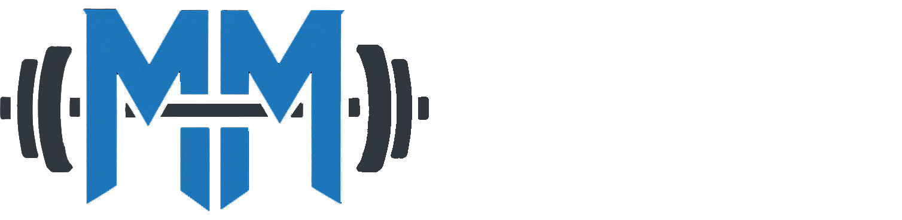

# MuscleMap 💪



> 智能健身訓練平台 - 結合人體肌肉地圖、專業動作指導與個人化課表規劃

[](https://nodejs.org/)
[](https://vuejs.org/)
[](https://quasar.dev/)

## 🌟 專案介紹

MuscleMap 是一個全方位的智能健身訓練平台，旨在為健身愛好者提供科學、高效的訓練體驗。通過創新的人體肌肉地圖可視化技術，結合專業的動作指導和個人化課表規劃，讓每個人都能找到最適合自己的健身之路。

### ✨ 核心功能

#### 🗺️ 互動式肌肉地圖

- **3D 人體模型**：提供男女性別選擇，正面背面視圖切換
- **智能肌肉標註**：點擊肌肉群即可查看相關訓練動作
- **器材篩選**：支援多種健身器材分類（啞鈴、槓鈴、徒手等）
- **視覺化高亮**：直觀顯示目標肌肉群與輔助肌肉

#### 📚 動作百科

- **豐富動作庫**：收錄超過 200+ 種專業健身動作
- **詳細動作指導**：包含動作說明、目標肌肉、使用器材
- **多維度篩選**：支援按肌肉群、器材、難易度篩選
- **智能搜尋**：快速查找所需動作

#### 📋 智能課表規劃

- **個人化課表**：創建專屬的週訓練計劃
- **週期化安排**：支援週一到週日的詳細規劃
- **動作編排**：自定義組數、次數、休息時間
- **公開分享**：優質課表可分享給社群

#### 📊 身體數據管理

- **Inbody 數據記錄**：體重、體脂肪、肌肉量追蹤
- **數據視覺化**：圖表展示身體組成變化趨勢
- **進度監控**：長期追蹤健身成效

#### 🧮 代謝計算工具

- **BMR 計算**：基礎代謝率精準計算
- **TDEE 評估**：每日總消耗熱量估算
- **營養建議**：根據目標提供飲食指導

#### 📰 健身資訊

- **精選文章**：專業健身知識與技巧分享
- **最新資訊**：健身趨勢與科學研究更新

#### 👥 社群功能

- **課表分享**：查看和點讚其他用戶的訓練課表
- **用戶互動**：建立健身社群，互相激勵
- **經驗交流**：分享健身心得與成果

## 🛠️ 技術架構

### 前端技術棧

- **Vue 3** - 漸進式 JavaScript 框架
- **Quasar Framework** - Vue.js 響應式 UI 組件庫
- **Pinia** - Vue 3 官方狀態管理
- **Vue Router** - 客戶端路由
- **Chart.js** - 數據視覺化圖表
- **Axios** - HTTP 客戶端
- **Vue I18n** - 國際化支援

### 開發工具

- **Vite** - 快速構建工具
- **ESLint** - 代碼品質檢查
- **Prettier** - 代碼格式化
- **PostCSS** - CSS 處理工具

### 核心依賴

```json
{
  "vue": "^3.4.18",
  "quasar": "^2.16.0",
  "pinia": "^3.0.1",
  "vue-router": "^4.0.0",
  "axios": "^1.2.1",
  "chart.js": "^4.5.0",
  "vue-chartjs": "^5.3.2",
  "vee-validate": "^4.15.1",
  "yup": "^1.6.1"
}
```

## 🚀 快速開始

### 環境需求

- Node.js ≥ 20.0.0
- npm 或 yarn 包管理器

### 安裝與運行

1. **克隆專案**

```bash
git clone https://github.com/Milktea910/MuscleMap.git
cd MuscleMap
```

2. **安裝依賴**

```bash
npm install
# 或
yarn install
```

3. **開發環境運行**

```bash
npm run dev
# 或
yarn dev
```

4. **生產環境構建**

```bash
npm run build
# 或
yarn build
```

5. **代碼檢查與格式化**

```bash
# ESLint 檢查
npm run lint

# Prettier 格式化
npm run format
```

## 📱 頁面結構

```
MuscleMap/
├── 🏠 首頁 (/)                    # 平台介紹與功能導覽
├── 🗺️ 肌肉地圖 (/muscle)          # 互動式人體肌肉地圖
├── 📚 動作百科 (/wiki)            # 健身動作資料庫
├── 💪 動作訓練 (/muscle-exercises) # 特定肌肉群動作展示
├── 📋 推薦課表 (/routines)         # 社群公開課表瀏覽
├── 📝 我的課表 (/myroutines)       # 個人課表管理
├── 📊 身體數據 (/inbody)          # Inbody 數據記錄與分析
├── 🧮 代謝計算 (/calculator)       # BMR/TDEE 計算工具
├── 📰 精選文章 (/articles)        # 健身相關文章
├── 👤 個人資料 (/profile)         # 用戶資料管理
├── 🔐 登入註冊 (/login, /register) # 用戶認證
└── ⚙️ 管理後台 (/admin)          # 系統管理功能
```

## 🎯 核心特色

### 🎨 使用者體驗

- **響應式設計**：完美適配桌面端與移動端
- **直觀操作**：簡潔明瞭的使用者介面
- **流暢動效**：精心設計的頁面過渡效果
- **無障礙設計**：支援鍵盤導航與螢幕閱讀器

### 🔒 數據安全

- **用戶認證**：安全的登入註冊機制
- **數據持久化**：本地儲存與雲端同步
- **隱私保護**：個人數據加密處理

### 📈 性能優化

- **懶加載**：按需載入頁面組件
- **數據快取**：減少重複請求
- **圖片優化**：響應式圖片載入
- **PWA 支援**：離線使用與安裝功能

## 🏗️ 專案結構

```
src/
├── assets/          # 靜態資源 (圖片、字體等)
├── boot/           # Quasar 啟動檔案
├── components/     # 可重用組件
│   ├── FemaleBack.vue     # 女性背面模型
│   ├── FemaleFront.vue    # 女性正面模型
│   ├── MaleBack.vue       # 男性背面模型
│   ├── MaleFront.vue      # 男性正面模型
│   └── InbodyChartsSection.vue # 身體數據圖表
├── composables/    # Vue 3 組合式函數
├── config/         # 配置檔案
│   └── muscleMapping.js   # 肌肉群對應配置
├── css/            # 全域樣式
├── i18n/           # 國際化語言包
├── layouts/        # 頁面佈局
├── pages/          # 頁面組件
├── router/         # 路由配置
├── services/       # API 服務層
│   ├── api.js             # API 基礎配置
│   ├── articleService.js  # 文章服務
│   ├── inbody.js         # 身體數據服務
│   ├── routine.js        # 課表服務
│   ├── user.js           # 用戶服務
│   └── wiki.js           # 動作百科服務
├── stores/         # Pinia 狀態管理
│   ├── article.js        # 文章狀態
│   ├── exercise.js       # 動作狀態
│   ├── inbody.js         # 身體數據狀態
│   ├── muscleMap.js      # 肌肉地圖狀態
│   ├── routine.js        # 課表狀態
│   └── user.js           # 用戶狀態
└── utils/          # 工具函數
```

## 🤝 貢獻指南

我們歡迎所有形式的貢獻！無論是：

- 🐛 回報 Bug
- 💡 提出新功能建議
- 📝 改善文檔
- 🔧 提交代碼修復
- 🎨 UI/UX 改善建議

### 如何貢獻

1. Fork 此專案
2. 創建您的功能分支 (`git checkout -b feature/AmazingFeature`)
3. 提交您的更改 (`git commit -m 'Add some AmazingFeature'`)
4. 推送到分支 (`git push origin feature/AmazingFeature`)
5. 開啟一個 Pull Request

## 📞 聯繫我們

- **作者**: AvantHaim
- **Email**: milkteaop12345@gmail.com
- **GitHub**: [@Milktea910](https://github.com/Milktea910)
- **專案首頁**: [https://milktea910.github.io/MuscleMap/](https://milktea910.github.io/MuscleMap/)

## 🙏 致謝

感謝所有為這個專案做出貢獻的開發者和使用者！

特別感謝：

- Vue.js 團隊提供優秀的前端框架
- Quasar 團隊提供強大的 UI 組件庫
- Chart.js 團隊提供優秀的圖表解決方案

---

**MuscleMap** - 讓科學健身變得簡單 💪

如果這個專案對您有幫助，請給我們一個 ⭐️ Star！
